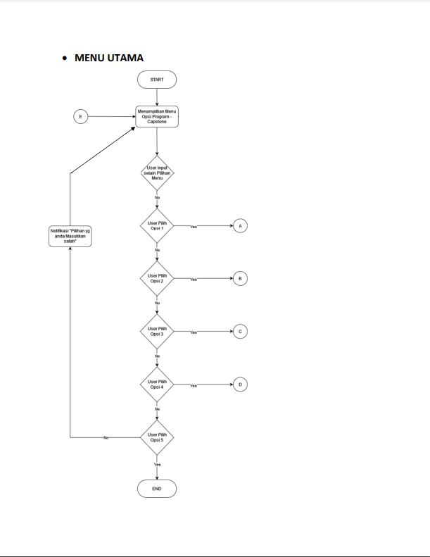
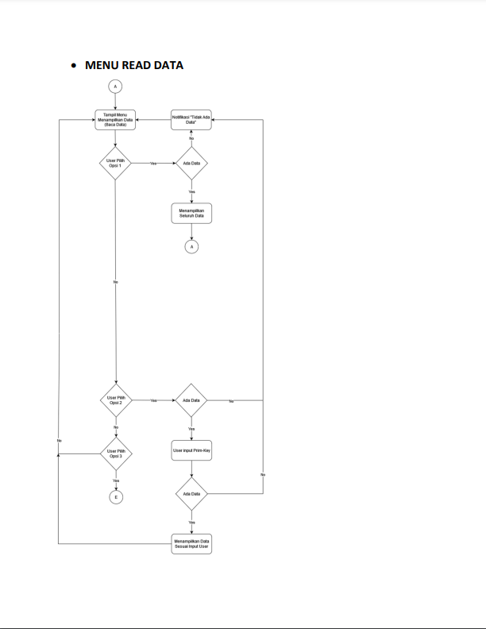
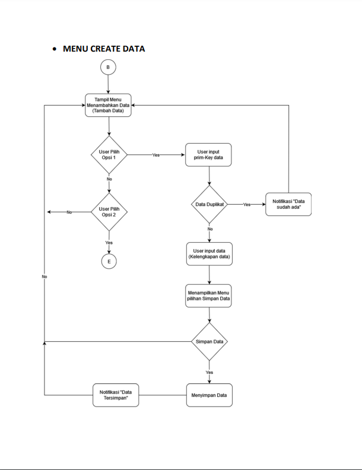
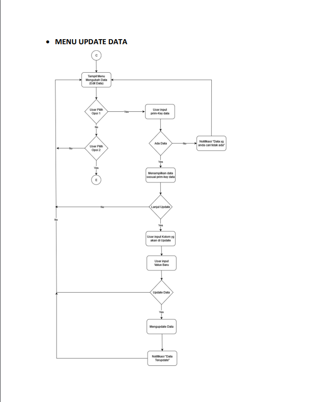
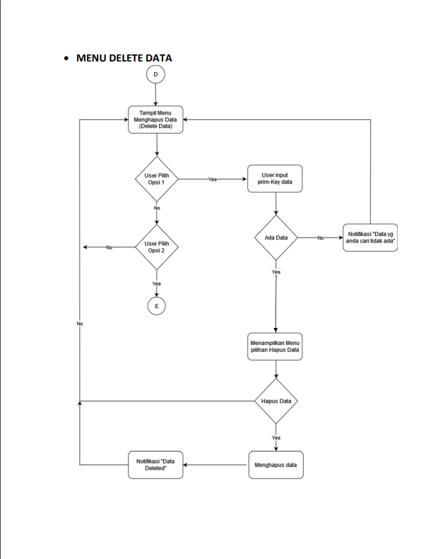

# Capstone Module 1  
Library - Books Lending

## Introduction

Each student will work on one of the study cases, where the study case will be selected by the Mentor. Each study case has at least 5 Fields (Columns / Keys) with 1 Unique Column.  

The application has 4 main features, students are expected to be able to make applications that meet or exceed predetermined standard requirements. :

* Main Menu  

* Read Menu  

* Create Menu  

* Update Menu  

* Delete Menu  

## Explanatory Video Link  
Youtube : https://youtu.be/wEiRkm8h4co
